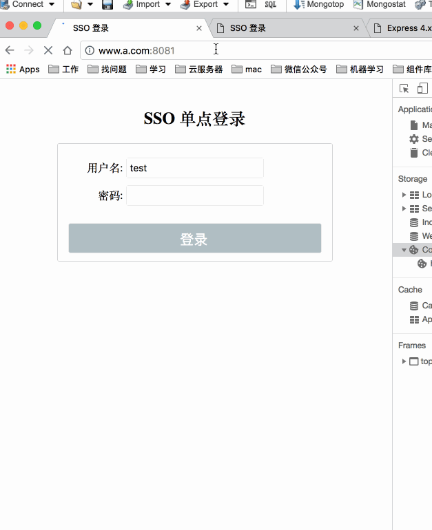

# NodeJs SSO 单点登录实例

> 项目来源：此项目 fork 了 `https://github.com/hezhii/nodejs-sso-example.git` ， 然后在这个项目上增加了单点注销的功能.

该实例实现了单点登录，单点注销的功能，使用 Express + MongoDb 实现， MongoDb 主要用于子系统的 Session 保存和 SSO 保存子系统的 SID(sessionId) 和 对应的 token.

## 一、单点登录

> from [《百度百科》](https://baike.baidu.com/item/%E5%8D%95%E7%82%B9%E7%99%BB%E5%BD%95/4940767?fr=aladdin)

单点登录（Single Sign On），简称为 SSO，是目前比较流行的企业业务整合的解决方案之一。SSO 的定义是在多个应用系统中，用户只需要登录一次就可以访问所有相互信任的应用系统。

## 二、效果



## 三、如何运行

### 3.1 下载代码，安装依赖

```bash
git clone https://github.com/zhongxia245/nodejs-sso-example.git

cd nodejs-sso-example

cnpm install
```

### 3.2 启动服务

启动服务前先修改本地的 hosts 文件，macOS 位于 /private/etc/hosts，windows 位于 C:\Windows\System32\drivers\etc\hosts。

在文件最后加上一行：`127.0.0.1 www.a.com www.b.com passport.com`

然后分别启动三个服务：

```bash
cd passport

node app.js

cd ../system

PORT=8081 SERVER_NAME=a node app.js

PORT=8082 SERVER_NAME=b node app.js
```

## 四、附上一张 SSO 单点登录的原理图

单点登录


单点注销

